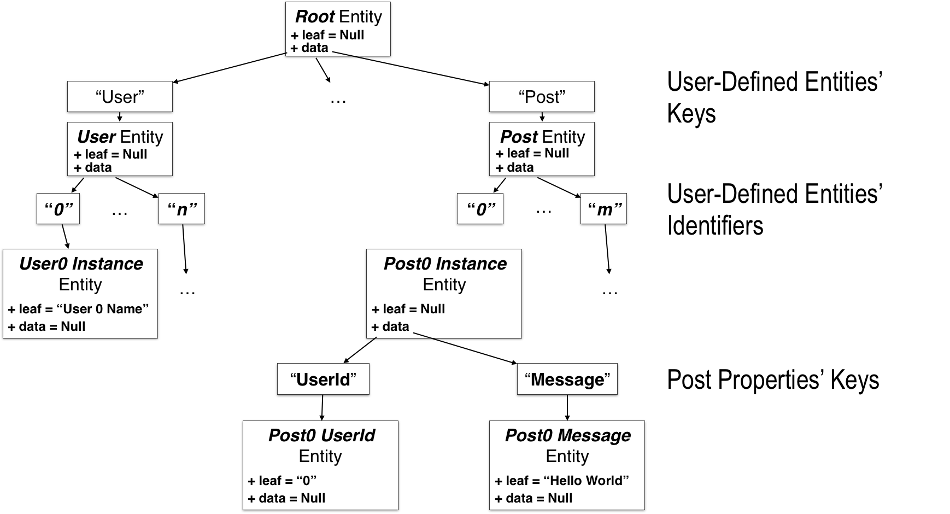
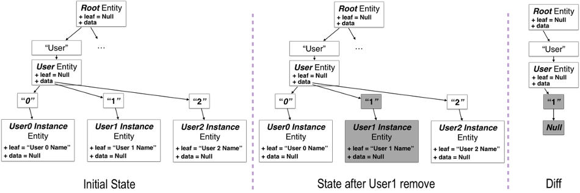
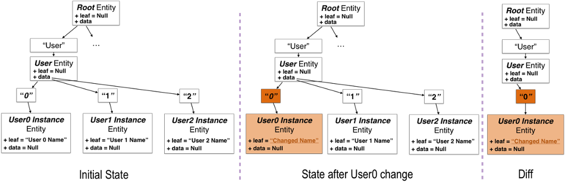

# Use cases
- Adding the first entity to a new application
- Adding the next entity to existing application with connection between entities
- Retrieving data
- Change and remove data
- Data access management
### Adding the first entity to a new application
For initial set up of the Framework with creation of first entity the following steps should be made.
1) Deploy the Server. In base use as a standalone service with remote database it does not require additional configuration in code. It can be deployed for example in Heroku or any other service supporting fat (or shadow) JAR format.
2) Include the client library in Android application.
In example the same User and Post entities will be used. The same steps should be made for any other entity.
3) Let User be the first entity of a new application. It can be represented as a data class in Kotlin as shown [here](../app/src/main/java/ru/beryukhov/remote_domain/domain/User.kt). There shown the full set of functions needed to use the User entity with the Framework. Now we need only `entity` and `createDiff` getter properties together with the underlying `diff` function. 
The entity property allows to transform User’s properties in pair of Id and Entity to be placed in Entity tree as shown below.

The `createDiff` property allows to transform new User into diff subtree corresponding to Create operation starting from root Entity as shown below.

4) The client library should be initialized. For that the RemoteDomainClient class should be instantiated with use of application context as a parameter. Then the `init` function should be called with three parameters. First is a HTTP URL of deployed server (starting with http:// or https://). Second is a WebSocket URL of deployed server (starting with ws://). Other parts of URL should be the same if server code was not modified and deployed as is. Third parameter is Boolean turning output of Framework logs on or off. It can be useful for debug purposes. The full code of this step is following:
``` kotlin
private const val BASE_URL = "some-app.herokuapp.com"
const val SOCKET_URL = "ws://$BASE_URL"
const val SERVER_URL = "http://$BASE_URL"
   ...
val remoteDomainClient: RemoteDomainClient by lazy {
   RemoteDomainClient(applicationContext).apply {
       init(
           serverUrl = SERVER_URL,
           socketUrl = SOCKET_URL,
           logRequests = BuildConfig.DEBUG
       )
   }
}
```
5) Last step is to use id generator and push a diff with new User into Framework. For that the `getNewId` and `pushChanges` functions should be called as shown below:
``` kotlin
remoteDomainClient.pushChanges(
   User(
       id = remoteDomainClient.getNewId(),
       userName = text
   ).createDiff
)
```
Now if make an HTTP GET request to server’s “entity” endpoint the JSON response similar to shown below can be received. Here the “User” subtree was created with one instance of User with autogenerated id “1_0”.
``` json
{
 "value": {
   "data": {
     "User": {
       "data": {
         "1_0": {
           "data": null,
           "leaf": "Marcin Moskala"
         }
       },
       "leaf": null
     }
   },
   "leaf": null
 }
}
```

### Adding the next entity to existing application with connection between entities
For creation of instance of new user-defined entity steps 3 and 5 from previous paragraph should be repeat. [Here](../app/src/main/java/ru/beryukhov/remote_domain/domain/Post.kt) shown the full code of Post class. This code is similar to same for User class and can be extracted into superclass.
In this example the first Post entity is connected with first User entity by passing its id in corresponding property of Post while its creation. Connection between any other entities can be made same by passing the id of one entity as a parameter of another. It is a common way of organization one-to-many connection for document-oriented databases. This can be also used for many-to-many connection. If the entities are connected as one-to-one – one of them can include the second inside its structure.

### Retrieving data
The data from the Framework can be retrieved in two ways: in observable form and in synchronous form (by request).
1) For retrieving data in observable form the `getEntityFlow` function can be used as shown below. For example, it can be used with `RecyclerView` and handled by immediate reflection of changes in it, as it made with lists in sample application. As for Flow class represents lazy data source, it is important not to forget finish the call chain by any terminal function, such as `launchIn` to start emitions of data. 
``` kotlin
presenterScope.launch {
   remoteDomainClient.getEntityFlow()
       .onEach(::updateEntityUI)
       .launchIn(CoroutineScope(Dispatchers.Default))
}
```
2) For retrieving data in synchronous form, the getEntity function can be used. It does not need any other actions and can be used for example for get of last list of Users in creation of new Post form (to show it in drop down list as in example application).
For mapping of Entity instance in list of Users or Posts extension functions shown below can be helpful. They use constructors of this classes from pair of id and Entity mentioned above.
``` kotlin
fun Entity.users(): List<User>? {
   return this.data?.get(USER)?.data?.entries?.map { it -> User(it.key, it.value!!) }
}

fun Entity.posts(): List<Post>? {
   return this.data?.get(POST)?.data?.entries?.map { it -> Post(it.key, it.value!!) }
}
```

### Change and remove data
For make user-defined class instances able to be changed or removed this classes should implement `updateDiff` and `deleteDiff` getting properties to be able generate corresponding diffs. Below  diffs for remove and update Entity operations are shown. Examples of this properties implementation are shown in [User](User.kt) and [Post](Post.kt) classes.



For change or remove user-defined class instance the diff generated by corresponding property from copy of existing instance should be passed into `pushChanges` function. The example for Post class is shown below.
``` kotlin
// for update
remoteDomainClient.pushChanges(
   post.copy(message = text).updateDiff
)
// for remove
remoteDomainClient.pushChanges(
   post.deleteDiff
)
```

### Data access management
To create an instance of class with limited access it is needed to fill the `privacyMode` property of corresponding Entity. This can be made by replace of `entity` property of class with function `getPrivateEntity` as shown for Post class below. `PrivacyMode` can be one of `PRIVATE`, `READ`, `UPDATE`. The `creatorClientId` property is autofilling by ClientLib.
``` kotlin
private fun getPrivateEntity(privacyMode: PrivacyMode) = Pair(
   id, Entity(
       data = mapOf(
           USER_ID to Entity(leaf = userId),
           MESSAGE to Entity(leaf = message)
       ),
       privacyMode = privacyMode
   )
)
```
 For change of privacy mode, the entity with changed `privacyMode` property should be passed to `updateDiff` and `pushChanges` functions the same way as with other properties update described above. The server will check that current user makes eligible changes and will return `ForbiddenClientId` error with 500 HTTP error code if not.


    